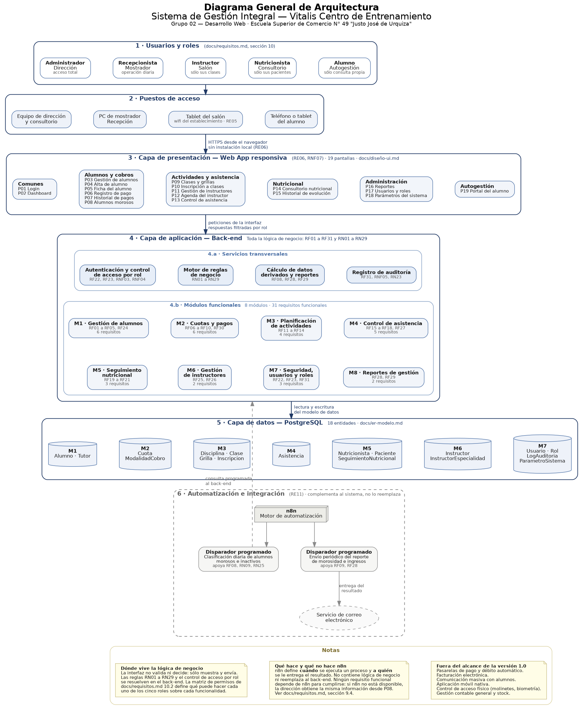

# Sistema de Gestión Integral — Vitalis Centro de Entrenamiento

Repositorio de documentación de análisis funcional del **Sistema de Gestión Integral para Vitalis Centro de Entrenamiento**, desarrollado como trabajo práctico de la materia **Desarrollo Web — Analista Funcional de Sistemas** de la Escuela Superior de Comercio N° 49 "Justo José de Urquiza" (Rosario, Santa Fe).

---

## Índice

- [1. ¿Qué es Vitalis?](#1-qué-es-vitalis)
- [2. Problema a resolver](#2-problema-a-resolver)
- [3. Objetivo del sistema](#3-objetivo-del-sistema)
- [4. Alcance](#4-alcance)
- [5. Actores principales](#5-actores-principales)
- [6. Módulos del sistema](#6-módulos-del-sistema)
- [7. Tecnologías y herramientas previstas](#7-tecnologías-y-herramientas-previstas)
- [8. Estructura del repositorio](#8-estructura-del-repositorio)
- [9. Documentación disponible](#9-documentación-disponible)
- [10. Diagramas](#10-diagramas)
- [11. Estado del proyecto](#11-estado-del-proyecto)
- [12. Integrantes](#12-integrantes)
- [13. Convenciones de trabajo](#13-convenciones-de-trabajo)

---

## 1. ¿Qué es Vitalis?

Vitalis es un centro de entrenamiento físico ubicado en **Pueblo Esther, provincia de Santa Fe** (decisión D2: la referencia a Rosario que aparece en este repositorio corresponde a la institución educativa, no al centro). Ofrece una amplia variedad de disciplinas en dos franjas horarias (turno mañana y turno tarde-noche) y complementa su propuesta con el servicio de una nutricionista.

**Disciplinas relevadas:**

| Disciplina | Perfil de alumno | Turnos habituales |
|---|---|---|
| Full Body | Adultos | Mañana y tarde-noche |
| Funcional | Adultos | Mañana y tarde-noche |
| Rutina Personalizada | Adultos | Ambos turnos |
| GAP | Adultos | Tarde-noche |
| Yoga | Adultos | Mañana |
| Zumba | Adultos | Tarde-noche |
| Pilates | Adultos | Mañana y tarde-noche |
| Aeróbica Infantil | Niños | Tarde |
| Kids Fit & Fun | Niños | Tarde |

> Pilates se incorpora al listado por la decisión D3: no figuraba en la oferta inicial, pero la modalidad de cobro combinada relevada la contempla.

**Dimensión aproximada de la operación:**

| Indicador | Valor |
|---|---|
| Alumnos registrados (activos e históricos) | Más de 200 |
| Instructores y profesionales | Alrededor de 12 |
| Franjas horarias | Mañana (07:00–12:00) y tarde-noche (16:00–22:00) |
| Servicio complementario | Consultorio nutricional (martes de 15:00 a 18:00) |

---

## 2. Problema a resolver

Actualmente **toda la gestión administrativa de Vitalis se realiza mediante planillas de cálculo** (Microsoft Excel): una planilla para el registro de alumnos y el seguimiento de cuotas, y otra para la planificación de actividades y la asignación de instructores.

Durante el relevamiento se identificaron las siguientes problemáticas:

| # | Problemática | Impacto |
|---|---|---|
| P1 | **Modalidades de cobro variables** (mensual fija, por clase, combinada). Cada alumno puede tener una condición distinta. | Dificulta el control automático de morosidad y la proyección de ingresos. |
| P2 | **Alta rotación de alumnos**: un porcentaje significativo de los registros corresponde a personas dadas de baja. | Riesgo de pérdida de historial si se eliminan registros; imposibilidad de reactivar alumnos con su información previa. |
| P3 | **Planificación por temporada**: la grilla de clases e instructores se reorganiza periódicamente (se relevaron al menos dos versiones distintas). | Las versiones anteriores se pisan o se duplican en archivos sueltos, sin trazabilidad. |
| P4 | **Ausencia de acceso a la información según el rol**: solo quien tiene la planilla puede consultar datos. | Instructores y alumnos dependen de terceros para cualquier consulta; el control de asistencia es informal o inexistente. |
| P5 | **Datos sensibles sin resguardo**: el seguimiento nutricional se lleva en registros físicos. | Riesgo de pérdida y de exposición de información de salud. |
| P6 | **Errores de carga y duplicación de registros** al no existir validaciones. | Padrón inconsistente; un alta duplicada contamina pagos, asistencias e historial. |

---

## 3. Objetivo del sistema

> Diseñar un sistema de información web que **centralice y digitalice los procesos administrativos de Vitalis**, eliminando la dependencia de las planillas manuales y brindando a cada actor —propietaria, recepcionista, instructores, nutricionista y alumnos— una herramienta **confiable, accesible y escalable**, con vistas y permisos diferenciados según su rol.

### Objetivos específicos

| ID | Objetivo |
|---|---|
| OE1 | Unificar el padrón de alumnos en un único repositorio digital, con validación de duplicados y baja lógica. |
| OE2 | Registrar los pagos de cuotas contemplando las tres modalidades de cobro vigentes y detectar la morosidad de forma automática. |
| OE3 | Gestionar la planificación de disciplinas, horarios e instructores admitiendo múltiples versiones de grilla. |
| OE4 | Digitalizar el control de asistencia para que cada instructor lo registre desde el salón. |
| OE5 | Aislar el seguimiento nutricional en un módulo de acceso restringido. |
| OE6 | Proveer reportes de gestión (morosidad, asistencia, ocupación) a la dirección. |
| OE7 | Implementar control de acceso por roles sobre todas las funcionalidades del sistema. |

---

## 4. Alcance

### Dentro del alcance

- Gestión de alumnos: altas, modificaciones, bajas lógicas y reactivaciones.
- Gestión de cuotas y pagos: registro de pagos con modalidades variables, seguimiento de morosidad y reportes.
- Planificación de actividades: gestión de disciplinas, horarios, turnos y versiones de grilla.
- Asignación de instructores a clases.
- Inscripción de alumnos a clases.
- Control de asistencia por clase y por alumno.
- Seguimiento nutricional: registro de consultas y evolución de parámetros.
- Gestión de instructores: altas, asignaciones y visualización de horarios propios.
- Reportes de gestión, con foco en morosidad.
- Gestión de usuarios y control de acceso por roles.

### Fuera del alcance

- Gestión contable general del negocio (libro diario, balances, liquidación de sueldos).
- Integración con medios de pago electrónicos externos (pasarelas, débito automático, QR).
- Comunicación masiva con alumnos (campañas, newsletters, notificaciones push).
- Facturación electrónica y su integración con organismos fiscales.
- Control de acceso físico al establecimiento (molinetes, tarjetas, biometría).
- Aplicación móvil nativa. La solución se plantea como web responsiva.

> Estos puntos quedan fuera de la **primera versión**. El sistema debe diseñarse de forma modular (RNF12) para poder incorporarlos más adelante sin refactorizar lo existente.

---

## 5. Actores principales

| Actor | Tipo | Rol en el sistema | Nivel de impacto |
|---|---|---|---|
| Propietaria / Directora | Interno | Administrador | Alto |
| Recepcionista / Personal administrativo | Interno — usuario operativo | Recepcionista | Alto |
| Instructores / Profesores | Interno — usuario operativo | Instructor | Alto |
| Nutricionista | Interno — usuario operativo | Nutricionista | Medio |
| Alumnos | Externo — beneficiario final | Alumno (consulta) | Alto |
| Familiares de alumnos menores | Externo — representante legal | Sin acceso directo en v1.0 | Medio |

El detalle completo de necesidades, expectativas, información requerida y riesgos asociados a cada actor se encuentra en [`docs/stakeholders.md`](docs/stakeholders.md).

---

## 6. Módulos del sistema

El sistema se organiza en ocho módulos que cubren los **31 requisitos funcionales** documentados.

| # | Módulo | Descripción | Requisitos | Total |
|---|---|---|---|:---:|
| M1 | **Gestión de alumnos** | Alta, modificación, baja lógica y reactivación. Padrón único con validación de DNI. | RF01–RF05, RF24 | 6 |
| M2 | **Gestión de cuotas y pagos** | Registro de pagos, modalidades de cobro variables, detección de morosidad e historial. | RF06–RF10, RF30 | 6 |
| M3 | **Planificación de actividades** | Disciplinas, clases, turnos, versiones de grilla e inscripción de alumnos. | RF11–RF14 | 4 |
| M4 | **Control de asistencia** | Listado de inscriptos por clase, registro de asistencia, asistente ocasional e historial. | RF15–RF18, RF27 | 5 |
| M5 | **Seguimiento nutricional** | Registro de consultas, evolución de parámetros y acceso restringido. | RF19–RF21 | 3 |
| M6 | **Gestión de instructores** | Alta y baja de instructores, asignaciones y agenda propia. | RF25, RF26 | 2 |
| M7 | **Seguridad, usuarios y roles** | Autenticación, gestión de usuarios, permisos y auditoría. | RF22, RF23, RF31 | 3 |
| M8 | **Reportes de gestión** | Morosidad, ingresos y ocupación de clases. | RF28, RF29 | 2 |
| | | | **Total** | **31** |

> **Nota de trazabilidad:** los módulos M6, M7 y M8 aparecen en el alcance del documento original pero no contaban con requisitos funcionales propios. Los requisitos que los cubren fueron incorporados por el equipo como **requisitos adicionales** (RF22 a RF31, decisión D4) y están identificados como tales en [`docs/requisitos.md`](docs/requisitos.md).

---

## 7. Tecnologías y herramientas previstas

La etapa actual del trabajo es de **análisis y diseño funcional**, por lo que todavía no hay implementación. La siguiente propuesta técnica es **preliminar y sujeta a confirmación** con la cátedra antes de comenzar el desarrollo.

| Capa | Propuesta | Motivo |
|---|---|---|
| Front-end | HTML5, CSS3, JavaScript y Bootstrap 5 | Interfaz responsiva exigida por RNF07 (uso en tablet desde el salón). |
| Back-end | Node.js con Express (alternativa evaluada: PHP 8) | Concentra toda la lógica de negocio y las reglas del sistema. |
| Base de datos | PostgreSQL | Modelo relacional acorde al ER documentado. |
| Automatización e integración | n8n | Ejecuta procesos periódicos y automáticos que no requieren intervención de un usuario. No reemplaza al back-end. |
| Reportes PDF | Librería de generación de PDF del lado del servidor | Exigido por RF09 (exportación del reporte de morosidad). |
| Modelado UML | PlantUML | Diagramas versionables en texto plano dentro del repositorio. |
| Wireframes | PlantUML Salt | Misma herramienta que el resto de los diagramas: texto plano, versionable y sin licencias. Ver [`diagramas/wireframes/README.md`](diagramas/wireframes/README.md). |
| Diagrama de arquitectura | Graphviz (DOT) | Permite fijar el apilado por capas, que PlantUML no garantiza. |
| Documentación | Markdown | Legible en GitHub y versionable. |
| Control de versiones | Git + GitHub | Trabajo colaborativo con ramas y Pull Requests. |
| Gestión ágil | Tablero Kanban (GitHub Projects) | Seguimiento de historias de usuario y slices. |

### Arquitectura conceptual

```text
   ┌──────────────┐        ┌──────────────┐        ┌──────────────┐
   │   Web App    │ ─────► │   Back-end   │ ─────► │  PostgreSQL  │
   │  (navegador  │        │  (lógica de  │        │   (datos)    │
   │   y tablet)  │ ◄───── │   negocio)   │ ◄───── │              │
   └──────────────┘        └──────┬───────┘        └──────┬───────┘
                                  │                       │
                                  │  consulta / dispara   │
                                  ▼                       ▼
                           ┌──────────────────────────────────┐
                           │              n8n                 │
                           │  Automatizaciones programadas    │
                           │  - Detección de morosidad        │
                           │  - Reportes periódicos           │
                           │  - Notificaciones (extensión)    │
                           └──────────────────────────────────┘
```

La vista completa y detallada está en el [diagrama general de arquitectura](#101--diagrama-general-de-arquitectura) de la sección 10.

**Sobre el rol de n8n.** La Web App y el back-end siguen siendo responsables de toda la funcionalidad del sistema: las altas, los cobros, la asistencia y las consultas se resuelven ahí. n8n se incorpora para lo que ocurre **sin que nadie lo pida**: tareas que se disparan por tiempo o por un evento y que hoy alguien tiene que acordarse de hacer.

| Automatización prevista | Qué resuelve | Estado |
|---|---|---|
| Detección y seguimiento de morosidad | Ejecuta a diario la clasificación de alumnos morosos (RF08) y de inactivos (RN25), y avisa a la dirección cuando aparecen casos nuevos. | Prevista para la implementación |
| Reportes periódicos a la dirección | Genera y envía el reporte de morosidad e ingresos con la frecuencia que la dirección defina, sin que tenga que entrar al sistema a pedirlo. | Prevista para la implementación |
| Notificaciones automáticas por email | Avisos de vencimiento de cuota o de cambios de grilla. | Extensión futura. La comunicación masiva con alumnos está fuera del alcance de la versión 1.0. |

El cálculo de la morosidad y la generación de los reportes se resuelven en el back-end. n8n solo decide **cuándo** ejecutarlos y **a quién** entregar el resultado.

---

## 8. Estructura del repositorio

```text
/
├── README.md                         # Portada del proyecto (este archivo)
├── integrantes.md                    # Equipo, forma de trabajo y registro de decisiones
├── RECURSOS.md                       # Guía de Git, GitHub, PlantUML y material de consulta
├── DoR.md                            # Definition of Ready del equipo
├── slicing.md                        # Épicas → historias → slices verticales
│
├── docs/
│   ├── requisitos.md                 # Contexto, alcance, RF, RNF, reglas y restricciones
│   ├── historias-de-usuario.md       # Historias con criterios de aceptación e INVEST
│   ├── casos-de-uso.md               # Casos de uso desarrollados
│   ├── er-modelo.md                  # Modelo entidad-relación y decisiones de diseño
│   ├── diseño-ui.md                  # Documentación funcional de las pantallas
│   └── stakeholders.md               # Análisis y matrices de stakeholders
│
├── diagramas/
│   ├── arquitectura-general.dot      # Diagrama general de arquitectura (Graphviz)
│   ├── arquitectura-general.png      # Imagen generada del diagrama general
│   ├── casos-de-uso.puml             # Diagrama UML de casos de uso (PlantUML)
│   ├── er.puml                       # Modelo entidad-relación (PlantUML)
│   └── wireframes/
│       ├── README.md                 # Criterio, herramienta y listado de bocetos
│       ├── NN-<pantalla>.puml        # Fuente de cada wireframe (PlantUML Salt)
│       ├── NN-<pantalla>.png         # Render de cada wireframe
│       └── explicaciones/            # Un .md por wireframe: qué muestra y por qué
│
└── cuestionario/
    ├── cuestionario-relevamiento.md  # Guías de entrevista, encuesta y observación
    ├── respuestas-relevamiento.md    # Respuestas obtenidas
    └── hallazgos.md                  # Hallazgos y su derivación a requisitos
```

---

## 9. Documentación disponible

| Documento | Contenido | Estado |
|---|---|---|
| [`docs/requisitos.md`](docs/requisitos.md) | Contexto, problema, objetivos, alcance, **RF01–RF31**, **RNF01–RNF13**, **RN01–RN29**, restricciones RE01–RE11, roles y matriz de permisos, dependencias y supuestos S01–S08. | Completo |
| [`docs/historias-de-usuario.md`](docs/historias-de-usuario.md) | **24 historias** con rol, módulo, requisitos relacionados, criterios de aceptación y evaluación INVEST justificada. | Completo |
| [`docs/casos-de-uso.md`](docs/casos-de-uso.md) | **17 casos de uso** (CU-00 a CU-16) con actores, precondiciones, postcondiciones, flujo normal, alternativas, excepciones, rendimiento y frecuencia estimada. | Completo |
| [`docs/er-modelo.md`](docs/er-modelo.md) | **18 entidades** con diccionario de datos, cardinalidades, claves, decisiones de diseño y alternativas descartadas. | Completo |
| [`docs/diseño-ui.md`](docs/diseño-ui.md) | **19 pantallas** (P01–P19): objetivo, acceso por rol, elementos, acciones, validaciones, mensajes y navegación. | Completo |
| [`docs/stakeholders.md`](docs/stakeholders.md) | **6 stakeholders** con ficha individual, matriz de impacto e interés, matriz de participación, intereses en conflicto y riesgos. | Completo |
| [`DoR.md`](DoR.md) | Definition of Ready en cuatro bloques de criterios, aplicada a tres historias propias con su autoevaluación. | Completo |
| [`slicing.md`](slicing.md) | **8 épicas** descompuestas en slices verticales, con orden de entrega en 9 iteraciones y patrones aplicados y descartados. | Completo |
| [`integrantes.md`](integrantes.md) | Equipo, reparto de la carga, flujo de trabajo y registro de decisiones D1 a D15 con su motivo. | Completo |
| [`RECURSOS.md`](RECURSOS.md) | Guía práctica de Git, GitHub, PlantUML, Graphviz y material de consulta. | Completo |
| [`cuestionario/`](cuestionario/) | Guías de relevamiento, respuestas obtenidas y hallazgos derivados a requisitos. | Completo |
| [`diagramas/`](diagramas/) | Diagrama de arquitectura, casos de uso, modelo ER y 10 wireframes con su explicación. | Completo |

---

## 10. Diagramas

Todos los diagramas se versionan como código fuente dentro de `diagramas/`, de modo que cualquier cambio quede registrado en el historial de Git y no dependa de un archivo binario.

| Archivo | Diagrama | Contenido |
|---|---|---|
| [`diagramas/arquitectura-general.dot`](diagramas/arquitectura-general.dot) | Arquitectura general | Vista completa del sistema en una sola lámina: roles, puestos de acceso, capa de presentación, back-end, base de datos y automatización. |
| [`diagramas/casos-de-uso.puml`](diagramas/casos-de-uso.puml) | Casos de uso (UML) | Actores del sistema, casos de uso por módulo y relaciones `include` / `extend`. |
| [`diagramas/er.puml`](diagramas/er.puml) | Entidad-relación | Entidades, atributos, claves primarias y foráneas, y cardinalidades. |
| [`diagramas/wireframes/`](diagramas/wireframes/) | Wireframes | 10 bocetos de baja fidelidad en PlantUML Salt, con una explicación por boceto en [`explicaciones/`](diagramas/wireframes/explicaciones/). |

### 10.1 — Diagrama general de arquitectura

Es la vista de conjunto del sistema. Integra en una sola lectura lo que el resto de la documentación desarrolla por separado: los cinco roles de `docs/requisitos.md`, las diecinueve pantallas de `docs/diseño-ui.md`, los ocho módulos con sus treinta y un requisitos funcionales, las dieciocho entidades de `docs/er-modelo.md` y la automatización prevista en la restricción RE11.



Se lee de arriba hacia abajo, en seis capas:

| Capa | Qué muestra |
|---|---|
| 1 · Usuarios y roles | Los cinco roles definidos en `docs/requisitos.md` 10.1, con el alcance de cada uno. |
| 2 · Puestos de acceso | Desde qué equipo trabaja cada rol. La tablet del salón corresponde a la restricción RE05. |
| 3 · Capa de presentación | Las diecinueve pantallas agrupadas por área funcional. |
| 4 · Capa de aplicación | Los servicios transversales y los ocho módulos funcionales. Acá vive toda la lógica de negocio. |
| 5 · Capa de datos | Las dieciocho entidades de PostgreSQL, agrupadas por el módulo que las usa. |
| 6 · Automatización | n8n y los dos procesos programados previstos. No contiene lógica de negocio. |

Dos aclaraciones que el diagrama deja explícitas, porque son las que suelen malinterpretarse:

- **La interfaz no valida ni decide.** Las reglas RN01 a RN29 y el control de acceso por rol se resuelven en el back-end. La matriz de permisos de `docs/requisitos.md` 10.2 define qué puede hacer cada rol sobre cada funcionalidad.
- **n8n no reemplaza al back-end.** Define *cuándo* se ejecuta un proceso y *a quién* se le entrega el resultado. Ningún requisito funcional depende de n8n para cumplirse.

### 10.2 — Wireframes y sus explicaciones

Los diez wireframes están en [`diagramas/wireframes/`](diagramas/wireframes/), cada uno con su fuente `.puml` y su render `.png`. La carpeta [`explicaciones/`](diagramas/wireframes/explicaciones/) contiene un documento por boceto que desarrolla qué representa, qué es cada elemento y por qué está, qué decisiones de diseño hace visibles y qué deja fuera de alcance.

De las diecinueve pantallas documentadas se bocetaron diez, con el criterio de cubrir al menos una pantalla por rol, las operaciones más frecuentes del centro y las pantallas con mayor riesgo de diseño. El criterio completo está en el [README de la carpeta](diagramas/wireframes/README.md).

### 10.3 — Cómo visualizar y regenerar los diagramas

**Diagramas en PlantUML** (`.puml`): abrir el archivo, copiar su contenido y pegarlo en el servidor oficial <https://www.plantuml.com/plantuml/uml/>. También pueden previsualizarse desde Visual Studio Code con la extensión **PlantUML** (`jebbs.plantuml`). En [`RECURSOS.md`](RECURSOS.md) está el paso a paso de instalación.

**Diagrama en Graphviz** (`.dot`): el diagrama general usa Graphviz en lugar de PlantUML porque necesita control explícito del apilado por capas, que PlantUML no garantiza. Los diagramas UML del repositorio siguen en PlantUML. Para regenerar la imagen después de editar el `.dot`:

```bash
dot -Tpng -Gdpi=110 diagramas/arquitectura-general.dot -o diagramas/arquitectura-general.png
```

Sin instalar nada, puede pegarse el contenido del `.dot` en <https://dreampuf.github.io/GraphvizOnline/>.

> Si se modifica el `.dot`, hay que volver a generar el `.png` en el mismo commit. La imagen de este README se rompe visualmente si queda desactualizada respecto del fuente.

---

## 11. Estado del proyecto

**Etapa actual:** análisis funcional y diseño de la solución, **completos**. No hay desarrollo de software iniciado: la implementación queda fuera del alcance de esta entrega.

| Entregable | Estado | Detalle |
|---|---|---|
| Relevamiento y contexto | Completo | Seis entrevistas, encuesta a alumnos, análisis documental y observación directa. Hallazgos derivados a requisitos en `cuestionario/hallazgos.md`. |
| Identificación de stakeholders | Completo | Seis stakeholders con ficha, matriz de impacto e interés, y mapa de intereses en conflicto. |
| Requisitos funcionales | Completo | RF01 a RF31, agrupados en ocho módulos. Incluye RF22 a RF31 como requisitos adicionales del equipo. |
| Requisitos no funcionales | Completo | RNF01 a RNF13 en cinco categorías: rendimiento, seguridad, usabilidad, disponibilidad y mantenibilidad, con valores verificables. |
| Reglas de negocio y restricciones | Completo | RN01 a RN29 y RE01 a RE11, cada una vinculada a los requisitos que la exigen. |
| Historias de usuario | Completo | 24 historias con criterios de aceptación y evaluación INVEST justificada criterio por criterio. |
| Casos de uso | Completo | 17 casos desarrollados (CU-00 a CU-16), con excepciones, rendimiento y frecuencia estimada. |
| Modelo entidad-relación | Completo | 18 entidades con diccionario de datos, decisiones de diseño y alternativas descartadas. |
| Diseño de interfaz | Completo | 19 pantallas documentadas y 10 wireframes con su explicación individual. |
| Definition of Ready | Completo | Criterios en cuatro bloques, aplicados a tres historias propias con autoevaluación. |
| Slicing vertical | Completo | 8 épicas descompuestas en slices, con orden de entrega en nueve iteraciones. |
| Registro de decisiones | Completo | D1 a D15 en `integrantes.md`, cada una con su motivo y los documentos que impacta. |
| Implementación | No iniciada | Fuera del alcance de la entrega actual. |

**Versión de la documentación:** v1.2
**Base:** Presentación Preliminar v1.0 (mayo de 2026)

---

## 12. Integrantes

| Integrante | Artefactos que redacta |
|---|---|
| **Duran, Berenice** | `docs/requisitos.md`, `docs/stakeholders.md`, `RECURSOS.md`, `cuestionario/` |
| **Gómez, Felipe** | `docs/er-modelo.md`, `diagramas/er.puml`, `diagramas/casos-de-uso.puml`, `DoR.md` |
| **Rodriguez, Lautaro** | `docs/casos-de-uso.md`, `docs/historias-de-usuario.md`, `slicing.md`, `integrantes.md` |
| **Verduna, Valentino** | `README.md`, `docs/diseño-ui.md`, `diagramas/wireframes/` |

El equipo trabaja de forma **horizontal**: los cuatro participan de todas las actividades del análisis y ninguno concentra la decisión final (decisión D9). Lo que se reparte es la redacción de cada artefacto, y la revisión rota en círculo. El detalle está en [`integrantes.md`](integrantes.md).

**Grupo:** Grupo 02
**Docente:** Pedernera, Pablo
**Institución:** Escuela Superior de Comercio N° 49 "Justo José de Urquiza" — Rosario, Santa Fe
**Materia:** Desarrollo Web — Analista Funcional de Sistemas
**Ciclo lectivo:** 2026

---

## 13. Convenciones de trabajo

### Ramas

| Rama | Uso |
|---|---|
| `main` | Documentación estable y revisada. |
| `docs/<tema>` | Redacción o modificación de documentación. |
| `diagram/<tema>` | Creación o ajuste de diagramas. |
| `fix/<tema>` | Corrección de errores o inconsistencias. |

### Mensajes de commit

Se utiliza una convención basada en *Conventional Commits*:

```text
docs:     agregar o modificar documentación
feat:     incorporar un nuevo artefacto o funcionalidad
fix:      corregir un error o una inconsistencia
refactor: reorganizar contenido sin cambiar su significado
diagram:  crear o actualizar un diagrama
```

Ejemplo:

```bash
git commit -m "docs: agregar README del proyecto Vitalis"
```

Todo cambio sobre `main` se integra mediante **Pull Request** con revisión de al menos un integrante. El procedimiento completo está en [`RECURSOS.md`](RECURSOS.md).

### Identificadores

| Prefijo | Qué identifica | Dónde se define |
|---|---|---|
| `RF` / `RNF` | Requisitos funcionales y no funcionales | `docs/requisitos.md` |
| `RN` / `RE` | Reglas de negocio y restricciones | `docs/requisitos.md` |
| `HU` | Historias de usuario | `docs/historias-de-usuario.md` |
| `CU` | Casos de uso | `docs/casos-de-uso.md` |
| `P` | Pantallas | `docs/diseño-ui.md` |
| `E` / `S` | Épicas y slices | `slicing.md` |
| `C` | Criterios de la Definition of Ready | `DoR.md` |
| `H` | Hallazgos del relevamiento | `cuestionario/hallazgos.md` |
| `D` | Decisiones del equipo | `integrantes.md` |

Los identificadores son únicos y estables: no se reutilizan ni se renumeran (decisión D1).

---

<sub>Escuela Superior de Comercio N° 49 "Justo José de Urquiza" — Desarrollo Web / Analista Funcional de Sistemas — 2026.</sub>
