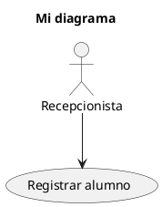
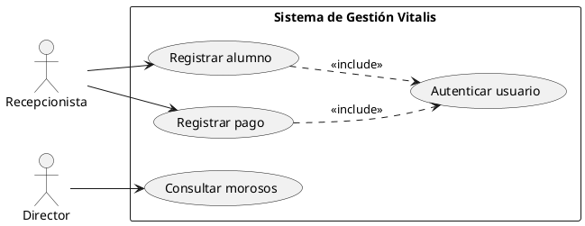
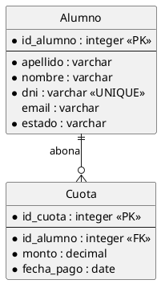

# Recursos y guía de trabajo

Guía práctica para trabajar en el repositorio del **Sistema de Gestión Integral — Vitalis Centro de Entrenamiento**.

Equipo: Grupo 02

Este documento está pensado para alguien que **recién empieza con Git y GitHub**. Explica desde cómo instalar las herramientas hasta cómo resolver los problemas más comunes. Si algo no se entiende, es un error del documento: avisá en el grupo y lo corregimos.

---

## Índice

- [1. Prerrequisitos](#1-prerrequisitos)
- [2. Qué es Git y qué es GitHub](#2-qué-es-git-y-qué-es-github)
- [3. Configuración inicial](#3-configuración-inicial-una-sola-vez)
- [4. Clonar el repositorio](#4-clonar-el-repositorio)
- [5. Comandos básicos de Git](#5-comandos-básicos-de-git)
- [6. Ramas](#6-ramas)
- [7. Commits](#7-commits)
- [8. Push y pull](#8-push-y-pull)
- [9. Pull Requests](#9-pull-requests)
- [10. Flujo completo de trabajo](#10-flujo-completo-de-trabajo-de-principio-a-fin)
- [11. Problemas frecuentes](#11-problemas-frecuentes)
- [12. Markdown](#12-markdown)
- [13. PlantUML](#13-plantuml)
- [14. Recursos de UML](#14-recursos-de-uml)
- [15. Recursos de análisis funcional](#15-recursos-de-análisis-funcional)
- [16. Recursos de metodologías ágiles](#16-recursos-de-metodologías-ágiles)
- [17. Herramientas recomendadas](#17-herramientas-recomendadas)
- [18. Glosario rápido](#18-glosario-rápido)

---

## 1. Prerrequisitos

Antes de trabajar en el repositorio necesitás tener instalado y configurado lo siguiente:

| # | Requisito | Cómo obtenerlo | Cómo verificar |
|---|---|---|---|
| 1 | **Git** | <https://git-scm.com/downloads> | `git --version` |
| 2 | **Cuenta de GitHub** | <https://github.com/signup> | Iniciar sesión en github.com |
| 3 | **Editor de texto** | Visual Studio Code: <https://code.visualstudio.com> | Abrir el programa |
| 4 | **Acceso al repositorio** | Pedir la invitación como colaborador al equipo | Ver el repo en tu lista de GitHub |
| 5 | **Navegador web** | Cualquiera actualizado | — |

### Extensiones recomendadas para Visual Studio Code

| Extensión | Identificador | Para qué sirve |
|---|---|---|
| PlantUML | `jebbs.plantuml` | Previsualizar los diagramas `.puml` sin salir del editor. |
| Markdown All in One | `yzhang.markdown-all-in-one` | Atajos, índice automático y vista previa de Markdown. |
| Markdown Preview Enhanced | `shd101wyy.markdown-preview-enhanced` | Vista previa más fiel a como se ve en GitHub. |
| GitLens | `eamodio.gitlens` | Ver quién escribió cada línea y cuándo. |
| Spanish Language Pack | `MS-CEINTL.vscode-language-pack-es` | Interfaz en español. |

> Para instalar una extensión: abrir VS Code → ícono de cuadrados en la barra lateral izquierda → buscar por nombre → **Install**.

---

## 2. Qué es Git y qué es GitHub

Es la confusión más común al empezar. **No son lo mismo.**

| | Git | GitHub |
|---|---|---|
| Qué es | Un programa que se instala en tu computadora. | Un sitio web. |
| Para qué sirve | Guardar el historial de cambios de tus archivos. | Alojar el repositorio en internet y trabajar en equipo. |
| Funciona sin internet | Sí | No |
| Analogía | El "control de cambios" de Word, pero mucho más potente. | Google Drive, pero para proyectos con historial. |

**En resumen:** Git lleva el registro de los cambios en tu máquina; GitHub es donde se guarda la copia compartida para que los cuatro integrantes trabajemos sobre lo mismo.

### Los tres estados de un archivo en Git

Entender esto evita el 80% de la confusión inicial:

```text
┌──────────────────┐   git add    ┌──────────────────┐  git commit  ┌──────────────────┐
│  Directorio de   │ ───────────► │   Staging Area   │ ───────────► │   Repositorio    │
│    trabajo       │              │  (área de        │              │      local       │
│                  │              │   preparación)   │              │                  │
│ Archivos que     │              │ Cambios          │              │ Cambios          │
│ estás editando   │              │ seleccionados    │              │ confirmados      │
└──────────────────┘              └──────────────────┘              └────────┬─────────┘
                                                                             │
                                                                    git push │
                                                                             ▼
                                                                    ┌──────────────────┐
                                                                    │     GitHub       │
                                                                    │ (repo remoto)    │
                                                                    └──────────────────┘
```

1. Editás un archivo → está en el **directorio de trabajo**.
2. `git add` → lo pasás al **staging area**: "este cambio quiero guardarlo".
3. `git commit` → lo confirmás en el **repositorio local** con un mensaje.
4. `git push` → lo subís a **GitHub** para que lo vean los demás.

---

## 3. Configuración inicial (una sola vez)

Después de instalar Git, abrí una terminal y ejecutá:

```bash
# Tu nombre, aparecerá en cada commit
git config --global user.name "Nombre Apellido"

# Tu email, tiene que ser el mismo de tu cuenta de GitHub
git config --global user.email "tuemail@ejemplo.com"

# Nombre por defecto de la rama principal
git config --global init.defaultBranch main

# Editor por defecto (opcional, para que use VS Code)
git config --global core.editor "code --wait"

# Verificar que quedó bien
git config --list
```

> **Importante:** el email tiene que coincidir con el de tu cuenta de GitHub. Si no, tus commits van a aparecer como de un usuario desconocido.

### Autenticación

GitHub ya no acepta contraseña desde la terminal. Tenés dos opciones:

**Opción A — Token personal (más simple para empezar)**

1. Ir a GitHub → foto de perfil → **Settings**.
2. Abajo de todo: **Developer settings** → **Personal access tokens** → **Tokens (classic)**.
3. **Generate new token (classic)**.
4. Ponerle un nombre (ej.: "Notebook facultad"), marcar el permiso **repo** y elegir una fecha de expiración.
5. **Generate token** y **copiar el token** (se muestra una sola vez).
6. Cuando Git te pida contraseña al hacer `push`, pegás el token en lugar de la contraseña.

**Opción B — GitHub CLI (más cómodo a largo plazo)**

```bash
# Instalar desde https://cli.github.com/ y luego:
gh auth login
```

Seguí las instrucciones en pantalla y listo: no te vuelve a pedir credenciales.

---

## 4. Clonar el repositorio

**Clonar** significa descargar una copia completa del repositorio a tu computadora.

```bash
# 1. Ir a la carpeta donde querés guardarlo
cd ~/Documentos/facultad

# 2. Clonar
git clone https://github.com/<usuario-u-organizacion>/vitalis-sistema-gestion.git

# 3. Entrar a la carpeta del proyecto
cd vitalis-sistema-gestion

# 4. Verificar que todo esté en orden
git status
```

Si `git status` responde algo como `En la rama main / nada para hacer commit`, ya está: el repositorio está listo.

> **Se clona una sola vez.** Después, para actualizar tu copia usás `git pull` (ver sección 8), no `git clone` de nuevo.

---

## 5. Comandos básicos de Git

### Los que vas a usar todos los días

| Comando | Qué hace |
|---|---|
| `git status` | Muestra qué archivos cambiaste y en qué rama estás. **Ante la duda, ejecutá esto.** |
| `git add <archivo>` | Prepara un archivo para el próximo commit. |
| `git add .` | Prepara **todos** los archivos modificados. |
| `git commit -m "mensaje"` | Confirma los cambios preparados con un mensaje descriptivo. |
| `git push` | Sube tus commits a GitHub. |
| `git pull` | Trae a tu máquina los cambios que otros subieron a GitHub. |
| `git log --oneline` | Muestra el historial de commits, uno por línea. |
| `git diff` | Muestra exactamente qué líneas cambiaste. |

### Los que vas a usar seguido

| Comando | Qué hace |
|---|---|
| `git branch` | Lista las ramas locales y marca en cuál estás. |
| `git branch -a` | Lista todas las ramas, incluidas las de GitHub. |
| `git switch <rama>` | Cambia a otra rama existente. |
| `git switch -c <rama>` | Crea una rama nueva y se cambia a ella. |
| `git merge <rama>` | Integra otra rama en la actual. |
| `git log --oneline --graph --all` | Historial en forma de árbol, útil para ver las ramas. |
| `git show <hash>` | Muestra el detalle de un commit específico. |

### Los de emergencia

| Comando | Qué hace | Cuidado |
|---|---|---|
| `git restore <archivo>` | Descarta los cambios sin guardar de un archivo. | **Se pierden los cambios.** |
| `git restore --staged <archivo>` | Saca un archivo del staging area sin perder los cambios. | Seguro. |
| `git commit --amend -m "nuevo mensaje"` | Corrige el mensaje del último commit. | Solo si **todavía no hiciste push**. |
| `git revert <hash>` | Crea un commit nuevo que deshace otro commit. | Seguro, no reescribe historial. |
| `git stash` | Guarda temporalmente los cambios sin commitear. | Recuperar con `git stash pop`. |
| `git reset --hard` | Descarta **todo** lo no commiteado. | **Peligroso. No hay vuelta atrás.** |

> **Regla del equipo:** si no estás seguro de qué hace un comando, preguntá antes de ejecutarlo. Es más rápido que recuperar el trabajo perdido.

---

## 6. Ramas

Una **rama** (*branch*) es una línea de trabajo paralela. Te permite escribir un documento sin tocar la versión estable que está en `main`.

### Por qué usamos ramas

Si los cuatro editáramos `main` al mismo tiempo, cada `push` pisaría el trabajo del anterior. Con ramas, cada uno trabaja aislado y después integramos de forma ordenada.

### Convención de nombres del proyecto

| Prefijo | Cuándo usarlo | Ejemplo |
|---|---|---|
| `docs/` | Crear o modificar documentación. | `docs/requisitos` |
| `diagram/` | Crear o ajustar un diagrama. | `diagram/er` |
| `fix/` | Corregir un error o una inconsistencia. | `fix/numeracion-rf` |
| `feat/` | Incorporar un artefacto nuevo. | `feat/cuestionario` |

Nombres en minúscula, sin acentos ni espacios, separando palabras con guiones.

### Comandos

```bash
# Ver en qué rama estoy
git branch

# Crear una rama nueva y cambiarme a ella (lo más común)
git switch -c docs/requisitos

# Cambiar a una rama que ya existe
git switch main

# Volver a la rama anterior
git switch -

# Traer una rama que creó otro integrante
git fetch origin
git switch docs/casos-de-uso

# Borrar una rama local ya integrada
git branch -d docs/requisitos

# Borrar la rama también en GitHub
git push origin --delete docs/requisitos
```

> **Antes de crear una rama, actualizá `main`:**
> ```bash
> git switch main
> git pull
> git switch -c docs/mi-tema
> ```
> Así partís del contenido más reciente y evitás conflictos innecesarios.

---

## 7. Commits

Un **commit** es una foto del proyecto en un momento dado, con un mensaje que explica qué cambió.

### Cómo hacer un commit

```bash
# 1. Ver qué cambió
git status

# 2. Preparar los archivos
git add docs/requisitos.md
# o, para preparar todo lo modificado:
git add .

# 3. Confirmar con un mensaje
git commit -m "docs: agregar requisitos funcionales del módulo de pagos"
```

### Convención de mensajes

Usamos una convención basada en *Conventional Commits*: `tipo: descripción en minúscula y en infinitivo`.

| Tipo | Cuándo usarlo |
|---|---|
| `docs:` | Agregar o modificar documentación. |
| `feat:` | Incorporar un artefacto o funcionalidad nueva. |
| `fix:` | Corregir un error o una inconsistencia. |
| `refactor:` | Reorganizar contenido sin cambiar su significado. |
| `diagram:` | Crear o actualizar un diagrama. |
| `chore:` | Tareas de mantenimiento del repositorio. |

### Ejemplos

**Bien:**

```bash
git commit -m "docs: agregar requisitos no funcionales de seguridad"
git commit -m "diagram: crear diagrama de casos de uso en PlantUML"
git commit -m "fix: corregir numeración de RF14 a RF15 en historias"
git commit -m "refactor: unificar formato de tablas en stakeholders"
```

**Mal:**

```bash
git commit -m "cambios"
git commit -m "asdasd"
git commit -m "arreglé todo"
git commit -m "subo el trabajo"
git commit -m "FINAL FINAL v2 ahora si"
```

### Buenas prácticas

- **Un commit = un cambio con sentido propio.** No mezcles la corrección de un typo con la escritura de un documento entero.
- **Commits chicos y frecuentes.** Es más fácil revisar diez commits claros que uno gigante.
- **El mensaje describe el *qué*, no el *cómo*.** "agregar reglas de negocio de morosidad", no "edité el archivo".
- **Nunca commitees a medias algo que rompe el documento.** Si tenés que cortar, usá `git stash`.

---

## 8. Push y pull

| Comando | Dirección | Qué hace |
|---|---|---|
| `git push` | Tu máquina → GitHub | Sube tus commits al repositorio remoto. |
| `git pull` | GitHub → Tu máquina | Baja los commits que subieron los demás. |

### Push

```bash
# Primera vez que subís una rama nueva
git push -u origin docs/requisitos

# Las veces siguientes, en esa misma rama
git push
```

El `-u` (o `--set-upstream`) vincula tu rama local con la de GitHub. Después de hacerlo una vez, alcanza con `git push`.

### Pull

```bash
# Traer los últimos cambios de la rama actual
git pull

# Traer específicamente lo último de main
git pull origin main
```

> **Hábito recomendado:** hacé `git pull` **al empezar** a trabajar y `git push` **al terminar**. Así minimizás los conflictos.

### Fetch vs. pull

| Comando | Qué hace |
|---|---|
| `git fetch` | Baja la información de GitHub pero **no toca** tus archivos. Sirve para mirar qué hay de nuevo. |
| `git pull` | Es `fetch` + `merge`: baja y además integra los cambios en tu copia. |

---

## 9. Pull Requests

Un **Pull Request** (PR) es una propuesta de cambio: "revisen esto que hice y, si está bien, incorpórenlo a `main`".

En este proyecto **todo cambio a `main` pasa por un PR**. Nadie hace push directo a `main`, ni siquiera el autor del documento.

### Cómo crear un Pull Request

1. Subí tu rama a GitHub:
   ```bash
   git push -u origin docs/requisitos
   ```
2. Entrá al repositorio en github.com. Va a aparecer un cartel amarillo: **Compare & pull request**. Hacé clic.
   (Si no aparece: pestaña **Pull requests** → **New pull request**.)
3. Verificá que diga: `base: main` ← `compare: docs/requisitos`.
4. Escribí el **título** con la misma convención de los commits: `docs: agregar documento de requisitos`.
5. Escribí la **descripción** usando esta plantilla:

   ```markdown
   ## Qué cambia
   Se agrega el documento `docs/requisitos.md` con RF01–RF21, RNF01–RNF13 y las reglas de negocio.

   ## Documentos afectados
   - `docs/requisitos.md` (nuevo)
   - `README.md` (se actualiza el estado de la tabla de documentación)

   ## Decisiones tomadas
   - Se incorporan los requisitos adicionales RF22–RF28 para cubrir los módulos M6, M7 y M8.

   ## Para revisar
   Verificar que la numeración no pise IDs existentes y que cada RF esté priorizado.
   ```
6. Asigná como **Reviewer** al integrante que te corresponde según la rotación.
7. **Create pull request**.

### Cómo revisar un Pull Request

1. Entrá al PR → pestaña **Files changed**.
2. Leé el contenido. Lo verde es lo agregado, lo rojo lo eliminado.
3. Para comentar una línea puntual: pasá el mouse por encima y hacé clic en el **+** azul.
4. Cuando termines: **Review changes** y elegí una opción:

   | Opción | Cuándo usarla |
   |---|---|
   | **Approve** | Está todo bien, se puede integrar. |
   | **Comment** | Tenés observaciones menores, pero no bloqueás. |
   | **Request changes** | Hay algo que corregir antes de integrar. |

### Qué mirar al revisar en este proyecto

- ¿Los IDs de requisitos son correctos y no se repiten?
- ¿Las referencias cruzadas apuntan a documentos e IDs que existen?
- ¿El documento contradice alguna decisión registrada en `integrantes.md`?
- ¿Las tablas de Markdown se ven bien en la vista previa?
- ¿Los enlaces internos funcionan?

### Cómo integrar el PR

Una vez aprobado, el autor hace clic en **Merge pull request** → **Confirm merge** → **Delete branch**.

Después, todos los integrantes actualizan su copia:

```bash
git switch main
git pull
```

---

## 10. Flujo completo de trabajo (de principio a fin)

Este es el ciclo que repetís cada vez que te toca un documento.

```bash
# 1. Pararte en main y actualizar
git switch main
git pull

# 2. Crear la rama de tu tarea
git switch -c docs/stakeholders

# 3. Trabajar: editar los archivos en VS Code
#    (podés hacer varios commits durante el trabajo)

# 4. Ver qué cambiaste
git status
git diff

# 5. Preparar y confirmar
git add docs/stakeholders.md
git commit -m "docs: agregar análisis y matriz de stakeholders"

# 6. Subir la rama a GitHub
git push -u origin docs/stakeholders

# 7. Crear el Pull Request desde github.com
#    y asignar al revisor que corresponde

# 8. Atender los comentarios de la revisión (si los hay)
#    Editar → git add → git commit → git push
#    (ya no hace falta el -u)

# 9. Una vez aprobado: hacer merge desde GitHub y borrar la rama

# 10. Volver a main y actualizar
git switch main
git pull

# 11. Borrar la rama local
git branch -d docs/stakeholders
```

---

## 11. Problemas frecuentes

### "Please tell me who you are"

```text
*** Please tell me who you are.
```

No configuraste tu identidad. Volvé a la [sección 3](#3-configuración-inicial-una-sola-vez).

---

### "Updates were rejected because the remote contains work that you do not have locally"

Alguien subió cambios después de tu último `pull`.

```bash
git pull
# resolver conflictos si los hay
git push
```

---

### Conflicto de merge

Cuando dos personas editan las mismas líneas, Git no sabe cuál conservar y marca el archivo así:

```text
<<<<<<< HEAD
El umbral de morosidad es de 30 días.
=======
El umbral de morosidad es de 45 días.
>>>>>>> docs/requisitos
```

**Cómo resolverlo:**

1. Abrí el archivo en VS Code (te ofrece botones: *Accept Current*, *Accept Incoming*, *Accept Both*).
2. Decidí qué texto queda. **Si es una decisión de contenido, consultalo con el equipo antes.**
3. Borrá las líneas `<<<<<<<`, `=======` y `>>>>>>>`.
4. Guardá y confirmá:
   ```bash
   git add docs/requisitos.md
   git commit -m "fix: resolver conflicto en el umbral de morosidad"
   git push
   ```

> Los conflictos son normales, no son un error tuyo. Con el reparto de documentos por integrante deberían ser poco frecuentes.

---

### "Me equivoqué de rama y trabajé sobre main"

Si **todavía no commiteaste**:

```bash
git stash                       # guardar los cambios
git switch -c docs/mi-tema      # crear la rama correcta
git stash pop                   # recuperar los cambios ahí
```

Si **ya commiteaste en main pero no hiciste push**:

```bash
git switch -c docs/mi-tema      # la rama nueva se lleva tus commits
git switch main
git reset --hard origin/main    # dejar main como estaba
git switch docs/mi-tema
```

---

### "Quiero deshacer el último commit"

```bash
# Deshacer el commit pero conservar los cambios en tus archivos
git reset --soft HEAD~1

# Deshacer el commit y descartar los cambios (¡se pierden!)
git reset --hard HEAD~1

# Si el commit YA está en GitHub, no uses reset: usá revert
git revert <hash-del-commit>
```

---

### "Borré un archivo sin querer"

```bash
# Si no commiteaste el borrado
git restore docs/requisitos.md

# Si ya commiteaste el borrado
git checkout HEAD~1 -- docs/requisitos.md
```

---

### "No sé en qué estado estoy"

```bash
git status                          # estado actual
git log --oneline -10               # últimos 10 commits
git branch -a                       # todas las ramas
git log --oneline --graph --all     # historial en árbol
```

---

## 12. Markdown

Toda la documentación del repositorio está en **Markdown** (`.md`): texto plano con marcas simples de formato.

### Sintaxis esencial

| Qué querés | Cómo se escribe |
|---|---|
| Título nivel 1 | `# Título` |
| Título nivel 2 | `## Subtítulo` |
| Negrita | `**texto**` |
| Cursiva | `*texto*` |
| Código en línea | `` `RF01` `` |
| Lista con viñetas | `- item` |
| Lista numerada | `1. item` |
| Enlace | `[texto](https://url)` |
| Enlace interno | `[requisitos](docs/requisitos.md)` |
| Cita / nota | `> texto` |
| Línea separadora | `---` |
| Imagen | `` |

### Tablas

```markdown
| ID | Requisito | Prioridad |
|---|---|---|
| RF01 | Registrar un nuevo alumno | Alta |
| RF02 | Validar DNI no duplicado | Alta |
```

Se ve así:

| ID | Requisito | Prioridad |
|---|---|---|
| RF01 | Registrar un nuevo alumno | Alta |
| RF02 | Validar DNI no duplicado | Alta |

**Alineación de columnas:**

```markdown
| Izquierda | Centrado | Derecha |
|:---|:---:|---:|
| a | b | c |
```

### Bloques de código

Se abren y cierran con tres acentos graves. Poner el lenguaje después de los primeros tres activa el coloreado:

````markdown
```bash
git commit -m "docs: agregar README"
```
````

### Errores comunes

- **Falta la línea en blanco antes de una lista o una tabla** → no se renderiza. Dejá siempre un renglón vacío antes.
- **Tabla mal alineada** → no importa que las columnas no coincidan visualmente, pero sí que cada fila tenga la misma cantidad de `|`.
- **Salto de línea** → un solo Enter no corta la línea. Usá dos espacios al final o un renglón en blanco.

### Recursos

- Guía oficial de Markdown en GitHub: <https://docs.github.com/es/get-started/writing-on-github>
- Hoja de referencia: <https://www.markdownguide.org/cheat-sheet/>
- Generador de tablas: <https://www.tablesgenerator.com/markdown_tables>

---

## 13. PlantUML

**PlantUML** permite escribir diagramas UML como código de texto. La herramienta genera la imagen automáticamente.

### Por qué lo usamos

| Ventaja | Explicación |
|---|---|
| Versionable | Al ser texto, Git muestra exactamente qué cambió en el diagrama. |
| Sin arrastrar cajas | Escribís las relaciones y el motor acomoda el diagrama solo. |
| Consistente | Todos los diagramas del proyecto tienen el mismo estilo. |
| Colaborativo | Dos personas pueden editar el mismo diagrama sin pisarse. |

### Cómo visualizar un diagrama

**Opción A — Servidor web (no requiere instalar nada)**

1. Abrí <https://www.plantuml.com/plantuml/uml/>
2. Copiá el contenido del archivo `.puml`.
3. Pegalo en el cuadro de texto.
4. Presioná **Submit** y el diagrama aparece abajo.

**Opción B — Visual Studio Code**

1. Instalá la extensión **PlantUML** (`jebbs.plantuml`).
2. Abrí el archivo `.puml`.
3. Presioná `Alt + D` para abrir la vista previa en vivo.

> La extensión usa el servidor público de PlantUML por defecto, así que necesita internet. No hace falta instalar Java ni Graphviz para este uso.

**Opción C — PlantText**

<https://www.planttext.com/> — alternativa al servidor oficial, con editor más cómodo.

### Estructura de un diagrama

Todo archivo `.puml` empieza con `@startuml` y termina con `@enduml`:



### Sintaxis para casos de uso



| Elemento | Sintaxis |
|---|---|
| Actor | `actor "Nombre" as ALIAS` |
| Caso de uso | `usecase "Nombre" as ALIAS` |
| Límite del sistema | `rectangle "Nombre" { ... }` |
| Asociación | `ACTOR --> CASO` |
| Include | `CASO_A ..> CASO_B : <<include>>` |
| Extend | `CASO_B ..> CASO_A : <<extend>>` |
| Orientación horizontal | `left to right direction` |

### Sintaxis para entidad-relación



**Cardinalidades:**

| Notación | Significado |
|---|---|
| `||--||` | Uno a uno |
| `||--o{` | Uno a muchos (el lado muchos puede ser cero) |
| `||--|{` | Uno a muchos (el lado muchos es al menos uno) |
| `}o--o{` | Muchos a muchos |

**Convenciones del proyecto:**

- `*` antes del atributo = campo obligatorio.
- `--` separa la clave primaria del resto de los atributos.
- `<<PK>>`, `<<FK>>`, `<<UNIQUE>>` para marcar el tipo de clave.
- Nombres de entidades en singular y con mayúscula inicial.

### Recursos

- Sitio oficial: <https://plantuml.com/es/>
- Casos de uso: <https://plantuml.com/es/use-case-diagram>
- Entidad-relación: <https://plantuml.com/es/ie-diagram>
- Diagramas de clases: <https://plantuml.com/es/class-diagram>
- Diagramas de secuencia: <https://plantuml.com/es/sequence-diagram>
- Guía de referencia completa (PDF): <https://plantuml.com/guide>

---

## 14. Recursos de UML

| Recurso | Tipo | Enlace |
|---|---|---|
| UML Diagrams — referencia completa por tipo de diagrama | Sitio web | <https://www.uml-diagrams.org/> |
| Especificación oficial de UML (OMG) | Documento | <https://www.omg.org/spec/UML/> |
| Guía de diagramas de casos de uso | Artículo | <https://www.visual-paradigm.com/guide/uml-unified-modeling-language/what-is-use-case-diagram/> |
| Guía de modelo entidad-relación | Artículo | <https://www.lucidchart.com/pages/es/que-es-un-diagrama-entidad-relacion> |
| *UML Distilled* — Martin Fowler | Libro | Addison-Wesley, 2003 |
| *Writing Effective Use Cases* — Alistair Cockburn | Libro | Addison-Wesley, 2001 |

### Aclaraciones sobre UML que suelen confundir

**`<<include>>` vs. `<<extend>>`**

| | `<<include>>` | `<<extend>>` |
|---|---|---|
| Significado | El caso base **siempre** ejecuta el incluido. | El caso extendido se ejecuta **solo a veces**. |
| Dirección de la flecha | Del caso base **hacia** el incluido. | Del caso extensión **hacia** el caso base. |
| Ejemplo en Vitalis | "Registrar pago" **incluye** "Autenticar usuario". | "Consultar morosos" **extiende** con "Exportar PDF". |

**Actor no es lo mismo que persona.** Un actor es un *rol*. Si la propietaria a veces cobra una cuota, en ese momento actúa como Recepcionista. Y un sistema externo también puede ser un actor.

**Un caso de uso no es una pantalla ni un botón.** Es un objetivo completo que el actor logra con el sistema. "Registrar pago de cuota" es un caso de uso; "hacer clic en Guardar" no.

---

## 15. Recursos de análisis funcional

| Recurso | Tipo | Enlace / referencia |
|---|---|---|
| *Ingeniería del Software* — Ian Sommerville (9.ª ed.) | Libro | Pearson Educación, 2011 |
| *Ingeniería del Software: un enfoque práctico* — Roger Pressman (7.ª ed.) | Libro | McGraw-Hill, 2010 |
| BABOK — Guía del cuerpo de conocimiento de análisis de negocio | Estándar | <https://www.iiba.org/business-analysis-body-of-knowledge/> |
| IEEE 830 — Especificación de requisitos de software | Norma | Referencia clásica para estructurar un SRS |
| Guía de escritura de requisitos | Artículo | <https://www.visual-paradigm.com/guide/requirements-gathering/what-is-requirements-elicitation/> |

### Cómo escribir un buen requisito funcional

Un requisito funcional bien escrito cumple:

| Característica | Qué significa |
|---|---|
| **Único** | Describe una sola cosa. Si tiene un "y", probablemente sean dos requisitos. |
| **Verificable** | Se puede comprobar si el sistema lo cumple o no. |
| **Sin ambigüedad** | No admite dos lecturas. Evitar "rápido", "amigable", "adecuado". |
| **Necesario** | Si se elimina, el sistema queda incompleto. |
| **Independiente de la solución** | Dice *qué* debe hacer el sistema, no *cómo* está programado. |
| **Trazable** | Tiene un ID estable y se puede seguir hasta una historia y un caso de uso. |

**Plantilla:** *"El sistema debe [acción] [objeto] [condición o restricción]."*

**Ejemplo del proyecto:**

> RF02 — El sistema debe validar que el DNI ingresado no esté duplicado antes de confirmar el alta.

**Contraejemplo:**

> ~~El sistema debe ser fácil de usar y rápido.~~
> No es verificable ni único. Eso corresponde a requisitos no funcionales, y hay que cuantificarlos (ver RNF01 y RNF08).

### Funcional vs. no funcional

| | Requisito funcional | Requisito no funcional |
|---|---|---|
| Responde a | ¿Qué **hace** el sistema? | ¿**Cómo** lo hace? |
| Ejemplo | RF06 — Registrar el pago de una cuota. | RNF01 — Responder en menos de 3 segundos. |
| Categorías típicas | Por módulo o proceso. | Rendimiento, seguridad, usabilidad, disponibilidad, mantenibilidad. |

---

## 16. Recursos de metodologías ágiles

| Recurso | Tipo | Enlace |
|---|---|---|
| Manifiesto Ágil | Documento | <https://agilemanifesto.org/iso/es/manifesto.html> |
| Guía de Scrum (Schwaber y Sutherland) | Documento | <https://scrumguides.org/> |
| Criterios INVEST (Bill Wake) | Artículo | <https://xp123.com/articles/invest-in-good-stories-and-smart-tasks/> |
| Patrones de división de historias | Artículo | <https://agileforall.com/patterns-for-splitting-user-stories/> |
| *User Story Mapping* — Jeff Patton | Libro | O'Reilly, 2014 |

### Criterios INVEST

Sirven para evaluar si una historia de usuario está bien formulada:

| Letra | Criterio | Pregunta que responde |
|---|---|---|
| **I** | Independiente | ¿Se puede desarrollar sin depender de otra historia? |
| **N** | Negociable | ¿El detalle puede discutirse con el cliente? |
| **V** | Valiosa | ¿Le aporta valor concreto a algún usuario? |
| **E** | Estimable | ¿El equipo puede estimar cuánto trabajo implica? |
| **S** | Pequeña (*Small*) | ¿Entra en una iteración? |
| **T** | Verificable (*Testable*) | ¿Se puede comprobar si está terminada? |

### Formato de historia de usuario

```text
Como <rol>, quiero <funcionalidad>, para <beneficio>.
```

**Ejemplo del proyecto:**

> Como recepcionista, quiero registrar el pago de la cuota de un alumno indicando el monto y el medio de pago, para mantener el control de ingresos y saber quién está al día.

---

## 17. Herramientas recomendadas

| Herramienta | Para qué | Enlace |
|---|---|---|
| **Visual Studio Code** | Editar Markdown y PlantUML. | <https://code.visualstudio.com> |
| **GitHub Desktop** | Usar Git con interfaz gráfica, sin terminal. | <https://desktop.github.com> |
| **PlantUML Web Server** | Ver diagramas sin instalar nada. | <https://www.plantuml.com/plantuml/uml/> |
| **PlantText** | Editor online de PlantUML. | <https://www.planttext.com/> |
| **Graphviz** | Generar el diagrama general de arquitectura a partir del archivo `.dot`. | <https://graphviz.org/download/> |
| **Graphviz Online** | Ver y editar el `.dot` sin instalar nada. | <https://dreampuf.github.io/GraphvizOnline/> |
| **Figma** | Wireframes y prototipos de interfaz. | <https://www.figma.com> |
| **Balsamiq** | Wireframes de baja fidelidad. | <https://balsamiq.com> |
| **Excalidraw** | Bocetos rápidos a mano alzada. | <https://excalidraw.com> |
| **draw.io** | Diagramas generales. | <https://app.diagrams.net> |
| **Tables Generator** | Armar tablas Markdown sin sufrir. | <https://www.tablesgenerator.com/markdown_tables> |
| **dbdiagram.io** | Diagramas de base de datos con código. | <https://dbdiagram.io> |
| **n8n** | Automatización de procesos periódicos e integración entre servicios. | <https://n8n.io> |
| **pgAdmin** | Administración de la base PostgreSQL. | <https://www.pgadmin.org> |
| **GitHub Projects** | Tablero Kanban del backlog. | Pestaña *Projects* del repositorio |
| **Learn Git Branching** | Practicar Git de forma visual e interactiva. | <https://learngitbranching.js.org/?locale=es_AR> |

### Material sobre n8n

n8n es la herramienta de automatización prevista en la arquitectura del proyecto. Se usa para tareas que se ejecutan solas, por tiempo o por un evento, sin que un usuario las pida: la detección diaria de alumnos morosos, el envío periódico de reportes a la dirección y, más adelante, las notificaciones automáticas.

**Conviene tener claro qué es y qué no es.** n8n no reemplaza al back-end ni contiene las reglas de negocio del sistema: esas viven en la aplicación. n8n arma flujos que dicen *cuándo* ejecutar algo y *qué hacer con el resultado*. Un flujo típico del proyecto sería: todos los días a las 8, consultar al back-end qué alumnos superaron el umbral de mora; si hay casos nuevos respecto de ayer, armar el listado y enviarlo por email a la dirección.

| Recurso | Formato | Enlace |
|---|---|---|
| Documentación oficial de n8n | Sitio web | <https://docs.n8n.io> |
| Guía de instalación con Docker | Documentación | <https://docs.n8n.io/hosting/installation/docker/> |
| Conceptos básicos: nodos, flujos y disparadores | Documentación | <https://docs.n8n.io/workflows/> |
| Nodo de PostgreSQL | Documentación | <https://docs.n8n.io/integrations/builtin/app-nodes/n8n-nodes-base.postgres/> |
| Nodo de disparador programado (Schedule Trigger) | Documentación | <https://docs.n8n.io/integrations/builtin/core-nodes/n8n-nodes-base.scheduletrigger/> |
| Documentación oficial de PostgreSQL en español | Sitio web | <https://www.postgresql.org/docs/current/> |

### Material para aprender Git

| Recurso | Formato |
|---|---|
| *Pro Git* (libro completo, gratis, en español) | <https://git-scm.com/book/es/v2> |
| Documentación oficial de GitHub en español | <https://docs.github.com/es> |
| Git Cheat Sheet de GitHub (PDF) | <https://education.github.com/git-cheat-sheet-education.pdf> |
| Oh Shit, Git!?! — cómo salir de líos comunes | <https://ohshitgit.com/es> |
| Learn Git Branching — práctica interactiva | <https://learngitbranching.js.org/?locale=es_AR> |

---

## 18. Glosario rápido

| Término | Significado |
|---|---|
| **Repositorio (repo)** | La carpeta del proyecto con todo su historial de cambios. |
| **Clonar** | Descargar una copia completa del repositorio a tu máquina. |
| **Commit** | Una confirmación de cambios, con mensaje y fecha. |
| **Branch (rama)** | Una línea de trabajo paralela. |
| **Main** | La rama principal, con la versión estable de la documentación. |
| **Merge** | Integrar los cambios de una rama en otra. |
| **Pull Request (PR)** | Propuesta de integrar una rama, abierta a revisión. |
| **Push** | Subir tus commits a GitHub. |
| **Pull** | Bajar a tu máquina los commits de GitHub. |
| **Fetch** | Consultar qué hay de nuevo en GitHub sin modificar tus archivos. |
| **Origin** | El nombre por defecto del repositorio remoto en GitHub. |
| **HEAD** | El commit en el que estás parado ahora mismo. |
| **Staging area** | Zona intermedia donde preparás los cambios antes del commit. |
| **Conflicto** | Dos ramas modificaron las mismas líneas y Git no puede decidir solo. |
| **Stash** | Guardado temporal de cambios sin commitear. |
| **Hash** | El identificador único de un commit (ej.: `a3f9c21`). |

---

<sub>Escuela Superior de Comercio N° 49 "Justo José de Urquiza" — Desarrollo Web / Analista Funcional de Sistemas — 2026.</sub>
