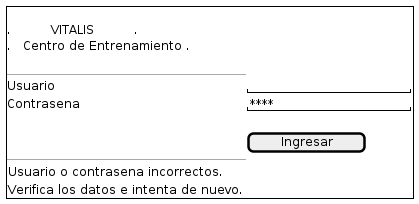

# 01 — Login

Explicación del wireframe [`01-login.puml`](01-login.puml).

| | |
|---|---|
| **Pantalla** | P01 — Login |
| **Rol** | Todos |
| **Historia** | HU-20 |
| **Caso de uso** | CU-00 |
| **Requisitos** | RF22, RNF03, RNF04, RNF09 |
| **Detalle funcional** | [`docs/diseño-ui.md`](../../docs/diseño-ui.md), pantalla P01 |

---

## Qué representa

Es la puerta de entrada al sistema y la única pantalla accesible sin sesión iniciada. Se nota a simple vista que no tiene encabezado, ni menú lateral, ni ruta de navegación, a diferencia de todas las demás pantallas del sistema. El motivo no es estético: el menú se arma según el rol del usuario, y antes de autenticarse no hay rol que consultar.

## Recorrido del boceto

| Zona del boceto | Qué es | Por qué está |
|---|---|---|
| Bloque VITALIS / Centro de Entrenamiento | Texto estático | Confirma al usuario que está en el sistema correcto antes de escribir sus credenciales. |
| Campo Usuario | Campo de texto obligatorio | Identifica al usuario. Lo crea el Administrador desde P17; no hay autoregistro. |
| Campo Contraseña | Campo de texto oculto | Se dibuja con asteriscos porque el requisito RNF04 exige que la contraseña no sea visible ni recuperable. |
| Botón Ingresar | Acción principal | Es la única acción de la pantalla. Presionar Enter en el campo de contraseña equivale a tocarlo. |
| Bloque de mensaje al pie | Área de mensajes | El boceto muestra el mensaje real de un intento fallido, no un texto de relleno: la redacción del mensaje es parte de la decisión de diseño. |

## Decisiones que el boceto hace visibles

- **El mensaje no dice cuál de los dos campos falló.** Dice "Usuario o contraseña incorrectos", nunca "ese usuario no existe". Distinguir entre los dos casos permitiría averiguar qué nombres de usuario son válidos. Viene del caso de uso CU-00.
- **El mensaje tiene dos partes: qué pasó y qué hacer.** Es el principio 4 del documento de diseño, que responde al requisito RNF09: ningún mensaje se limita a informar un error.
- **No hay enlace de crear cuenta ni de recuperar contraseña.** Las cuentas las administra el rol Administrador desde P17. Un centro de entrenamiento con quince empleados no necesita un flujo de autogestión de credenciales.

## Lo que este boceto no define

Un wireframe define qué elementos tiene la pantalla y cómo se organizan. No define colores, tipografías, iconos ni espaciados exactos: eso corresponde a la etapa de implementación. Tampoco muestra los estados alternativos de la pantalla —errores, listas vacías, cargas en curso—, que están descriptos en `docs/diseño-ui.md`. En esta pantalla quedan fuera del boceto otros dos mensajes previstos: el de cuenta desactivada y el de servicio no disponible.

---

Escuela Superior de Comercio N° 49 "Justo José de Urquiza" — Desarrollo Web / Analista Funcional de Sistemas — Grupo 02 — 2026.
