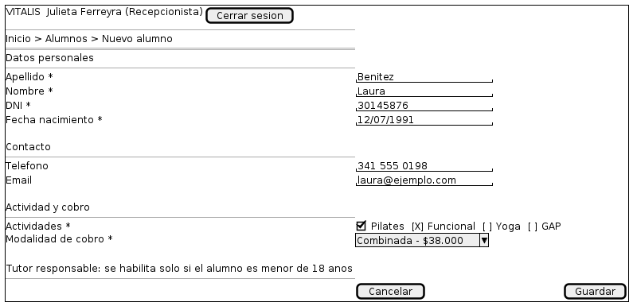

# 04 — Alta de alumno

Explicación del wireframe [`04-alta-alumno.puml`](04-alta-alumno.puml).

| | |
|---|---|
| **Pantalla** | P04 — Alta de alumno |
| **Rol** | Administrador y Recepcionista |
| **Historias** | HU-01, HU-06 |
| **Casos de uso** | CU-01, CU-04, CU-06 |
| **Requisitos** | RF01, RF02, RF03, RNF09 |
| **Detalle funcional** | [`docs/diseño-ui.md`](../../docs/diseño-ui.md), pantalla P04 |

---

## Qué representa

Es el formulario con el que entra un alumno nuevo al padrón, y el mismo que se usa para editarlo. Está dividido en tres bloques con título, en lugar de una lista larga de campos: datos personales, contacto, y actividad y cobro.

## Recorrido del boceto

| Zona del boceto | Qué es | Por qué está |
|---|---|---|
| Bloque Datos personales | Cuatro campos obligatorios | Apellido, nombre, DNI y fecha de nacimiento. Son el mínimo para que un registro del padrón sirva de algo. |
| Bloque Contacto | Dos campos opcionales | Teléfono y email. No bloquean el alta: en el relevamiento se vio que muchas altas se hacen con el alumno apurado en el mostrador. |
| Bloque Actividad y cobro | Selección múltiple y selector | Al menos una actividad y una modalidad de cobro, ambas obligatorias. |
| Modalidad con el precio a la vista | Selector | Muestra "Combinada - $38.000". El monto se lee al elegir, porque es lo que después se precarga al cobrar. |
| Nota del tutor responsable | Sección condicional | El bloque de tutor no está dibujado porque no siempre existe: aparece solo si la fecha de nacimiento indica menos de 18 años. |
| Botones Cancelar y Guardar | Acciones | Guardar valida y muestra el legajo asignado; Cancelar descarta y vuelve al listado. |

## Decisiones que el boceto hace visibles

- **El tutor aparece solo, no se marca.** No hay una casilla de "es menor" que el usuario tenga que acordarse de tildar: el sistema lo deduce de la fecha de nacimiento. Viene de la regla RN05 y resuelve el conflicto CF2.
- **El asterisco marca lo obligatorio y nada más.** Seis campos obligatorios sobre diez: los cuatro personales más la actividad y la modalidad. Todo lo demás puede completarse después.
- **La modalidad se elige de una lista, no se escribe.** En la planilla actual la modalidad combinada figura escrita de cinco formas distintas. Un selector cierra esa puerta.

## Lo que este boceto no define

Un wireframe define qué elementos tiene la pantalla y cómo se organizan. No define colores, tipografías, iconos ni espaciados exactos: eso corresponde a la etapa de implementación. Tampoco muestra los estados alternativos de la pantalla —errores, listas vacías, cargas en curso—, que están descriptos en `docs/diseño-ui.md`. No están dibujados el bloque del tutor desplegado ni los mensajes de DNI duplicado y de DNI de un alumno dado de baja, que son dos de las validaciones más importantes de esta pantalla.

---

Escuela Superior de Comercio N° 49 "Justo José de Urquiza" — Desarrollo Web / Analista Funcional de Sistemas — Grupo 02 — 2026.
