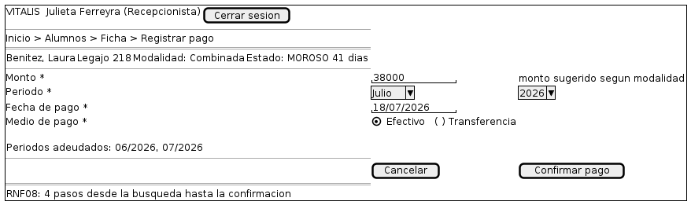

# 06 — Registro de pago

Explicación del wireframe [`06-registro-pago.puml`](06-registro-pago.puml).

| | |
|---|---|
| **Pantalla** | P06 — Registro de pago |
| **Rol** | Administrador y Recepcionista |
| **Historia** | HU-02 |
| **Caso de uso** | CU-02 |
| **Requisitos** | RF06, RF07, RNF08 |
| **Detalle funcional** | [`docs/diseño-ui.md`](../../docs/diseño-ui.md), pantalla P06 |

---

## Qué representa

Es la pantalla con la restricción de diseño más dura de todo el sistema: el requisito RNF08 limita el cobro a cuatro pasos desde la búsqueda del alumno hasta la confirmación. Todo lo que se ve en el boceto está al servicio de que el caso frecuente se confirme sin tipear nada.

## Recorrido del boceto

| Zona del boceto | Qué es | Por qué está |
|---|---|---|
| Encabezado del alumno | Contexto | Apellido y nombre, legajo, modalidad vigente y situación de cuenta. Evita confirmar un cobro sobre el alumno equivocado. |
| Campo Monto | Numérico precargado | Viene con el monto de la modalidad del alumno. Es editable, pero en el caso habitual no se toca. |
| Campo Período | Dos selectores | Mes y año, precargados con el período en curso. No se muestra en la modalidad por clase. |
| Campo Fecha de pago | Fecha precargada | Viene con el día de hoy. |
| Medio de pago | Opción excluyente | Efectivo o transferencia. Son los dos medios relevados. |
| Aviso de períodos adeudados | Texto dinámico | Lista los períodos pendientes para que la recepcionista pueda elegir a cuál imputar el pago. |
| Nota RNF08 al pie | Aclaración del boceto | Deja constancia de que la pantalla fue diseñada contra un requisito medible, no por criterio estético. |

## Decisiones que el boceto hace visibles

- **Todo lo que puede precargarse viene precargado.** Monto, período y fecha. En el caso más frecuente —alumno mensual que paga el mes en curso— confirmar el pago no requiere modificar ningún campo.
- **El monto es editable igual.** Se precarga pero no se impone: el relevamiento mostró pagos parciales y ajustes, y un campo bloqueado obligaría a salir del sistema para resolverlos.
- **La deuda anterior se muestra sin interrumpir.** Aparece como información al costado, no como un diálogo que haya que cerrar antes de cobrar.

## Lo que este boceto no define

Un wireframe define qué elementos tiene la pantalla y cómo se organizan. No define colores, tipografías, iconos ni espaciados exactos: eso corresponde a la etapa de implementación. Tampoco muestra los estados alternativos de la pantalla —errores, listas vacías, cargas en curso—, que están descriptos en `docs/diseño-ui.md`. No está dibujada la variante de la modalidad por clase, que reemplaza el período por la cantidad de clases abonadas, ni la advertencia de pago duplicado para un mismo período.

---

Escuela Superior de Comercio N° 49 "Justo José de Urquiza" — Desarrollo Web / Analista Funcional de Sistemas — Grupo 02 — 2026.
