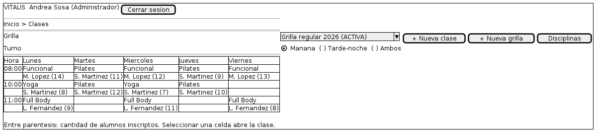

# 08 — Gestión de clases y grillas

Explicación del wireframe [`08-gestion-clases.puml`](08-gestion-clases.puml).

| | |
|---|---|
| **Pantalla** | P09 — Gestión de clases y grillas |
| **Rol** | Administrador (Recepcionista, solo consulta) |
| **Historias** | HU-12, HU-13, HU-14 |
| **Casos de uso** | CU-08, CU-09, CU-10 |
| **Requisitos** | RF11, RF12, RF13 |
| **Detalle funcional** | [`docs/diseño-ui.md`](../../docs/diseño-ui.md), pantalla P09 |

---

## Qué representa

Es la pantalla donde se arma la planificación del centro. Lo primero que se nota es que no es un listado de clases sino un calendario semanal, y esa es la decisión de diseño principal del boceto.

## Recorrido del boceto

| Zona del boceto | Qué es | Por qué está |
|---|---|---|
| Selector de grilla | Desplegable | Muestra "Grilla regular 2026 (ACTIVA)". Permite pasar de una versión a otra sin salir de la pantalla. |
| Botones Nueva clase, Nueva grilla y Disciplinas | Acciones | Las tres operaciones de mantenimiento de la planificación, separadas de la vista. |
| Selector de turno | Opción excluyente | Mañana, tarde-noche o ambos. El centro opera en dos franjas bien separadas y verlas juntas no aporta. |
| Calendario semanal | Grilla de horarios por día | Cada celda es una clase, con la disciplina arriba y el instructor abajo. |
| Número entre paréntesis | Cantidad de inscriptos | Permite ver de un vistazo qué clases están llenas y cuáles vacías, sin abrir ninguna. |
| Celdas vacías | Espacio sin clase | Muestran los huecos de la grilla, que es información tan útil como las clases cargadas. |
| Nota al pie | Aclaración de comportamiento | Seleccionar una celda abre la clase para editarla. |

## Decisiones que el boceto hace visibles

- **Calendario y no listado.** La vista semanal reproduce la forma en que la dirección piensa la grilla. Un listado plano obligaría a reconstruir mentalmente la organización horaria cada vez.
- **El selector de grilla resuelve un problema real.** Hoy conviven dos hojas de planificación sin indicación de cuál rige. La etiqueta ACTIVA elimina esa ambigüedad, y poder cambiar de versión reemplaza la práctica de tener dos archivos abiertos.
- **La cantidad de inscriptos va en la celda.** Es el dato que permite detectar una clase que no se sostiene sin entrar a revisarla.

## Lo que este boceto no define

Un wireframe define qué elementos tiene la pantalla y cómo se organizan. No define colores, tipografías, iconos ni espaciados exactos: eso corresponde a la etapa de implementación. Tampoco muestra los estados alternativos de la pantalla —errores, listas vacías, cargas en curso—, que están descriptos en `docs/diseño-ui.md`. No está dibujado el detalle de una clase abierta, ni el aviso de superposición de instructor, que es el punto de falla que el relevamiento detectó en este circuito.

---

Escuela Superior de Comercio N° 49 "Justo José de Urquiza" — Desarrollo Web / Analista Funcional de Sistemas — Grupo 02 — 2026.
